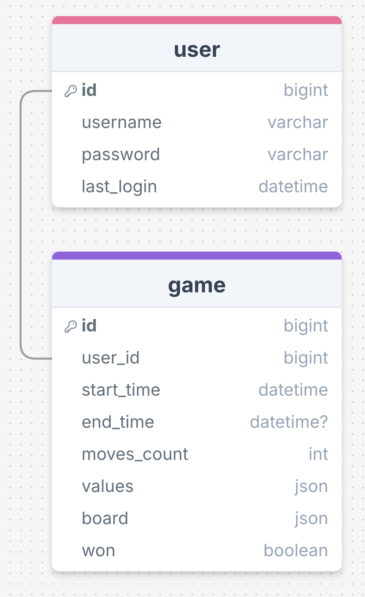
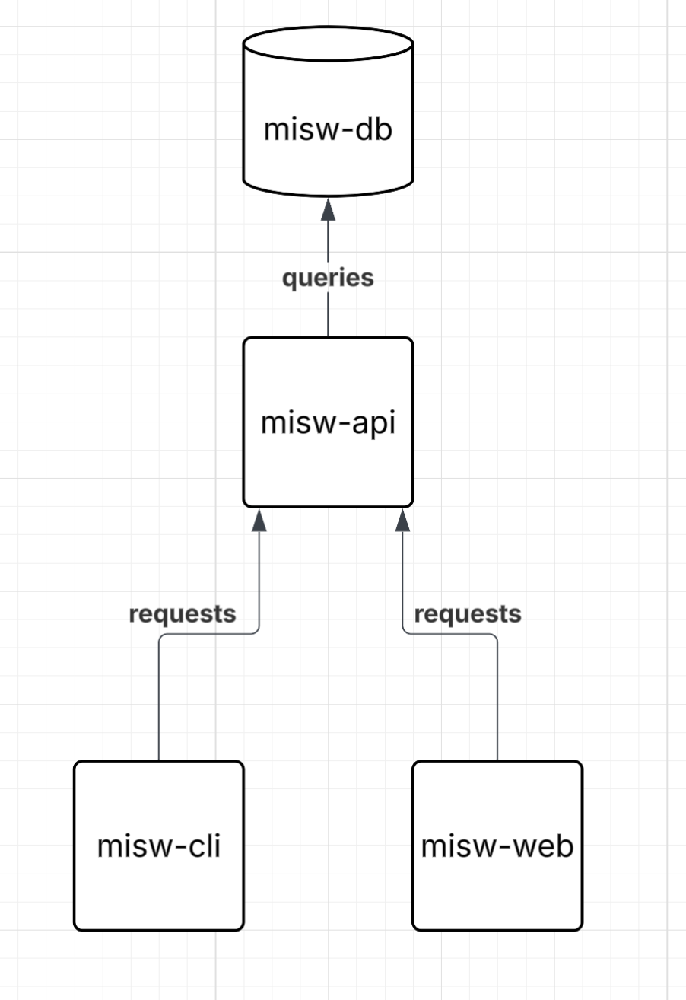

# Initial Design — Minesweeper Suite (Go API + Rust CLI + PHP Web UI)

## 1) Project Purpose & Goals

**Purpose:**  
Build a connected Minesweeper ecosystem that proves how one API can power multiple frontends—while I learn Go (backend), Rust (terminal client), and PHP (web UI).

**What this delivers:**  
- A **Go API** centralizing all game logic (board generation, reveals/flags, win/loss), user accounts, and leaderboards.  
- A **Rust CLI** for fast, terminal-based play.  
- A **PHP web UI** for playing in the browser and viewing stats/leaderboards.  
- Shared persistence (PostgreSQL) so progress and scores are consistent across clients.

**Why this matters:**  
- Demonstrates clean separation of concerns: one authoritative logic layer, multiple clients.  
- Teaches me three different language/toolchains with one cohesive product.  
- Produces a fun, testable game with real users (me + classmates) and real data.

---

## 2) Initial ERD & Data (sketch)

---

## 3) Rough System Design

**Stack & interactions**

---

## 4) Daily Goals

**Day 1 — Project kickoff**
- Finalize ERD, outline API endpoints.
- Initialize Go module and Dockerized Postgres.
- Create migrations for users, games, moves, scores.

**Day 2 — Core board logic in Go**
- Implement mine placement and neighbor counts.
- Implement reveal, flag/unflag logic.
- Add unit tests for edge cases.

**Day 3 — Game lifecycle endpoints**
- Auth endpoints (`register`, `login`).
- Game endpoints (`create`, `fetch`).
- Persist start/finish timestamps.

**Day 4 — Move endpoint + validation**
- `POST /games/:id/moves` with action validation.
- Return board view.
- Integration tests for gameplay flow.

**Day 5 — Scores & leaderboards**
- Write score entries on win/loss.
- Add leaderboard queries and indexes.

**Day 6 — Rust CLI foundation**
- Connect to API, implement login + new game.
- Build TUI rendering grid and keybindings.

**Day 7 — Rust CLI polish**
- Add colors, better UX, summary display.

**Day 8 — PHP Web UI foundation**
- Setup project, auth pages, fetch & render board.

**Day 9 — PHP Web UI gameplay**
- Implement reveal/flag interactions.
- Win/loss modals and stats view.

**Day 10 — Leaderboards & profile**
- Display global and per-board leaderboards.
- Add user stats page.

**Day 11 — Testing & optimization**
- Benchmark Go board generation.
- Fix UI bugs and tune DB queries.

**Day 12 — Documentation & polish**
- Write README + run instructions.
- Demo prep and screenshots.
- Optional: add replay and seed presets.
