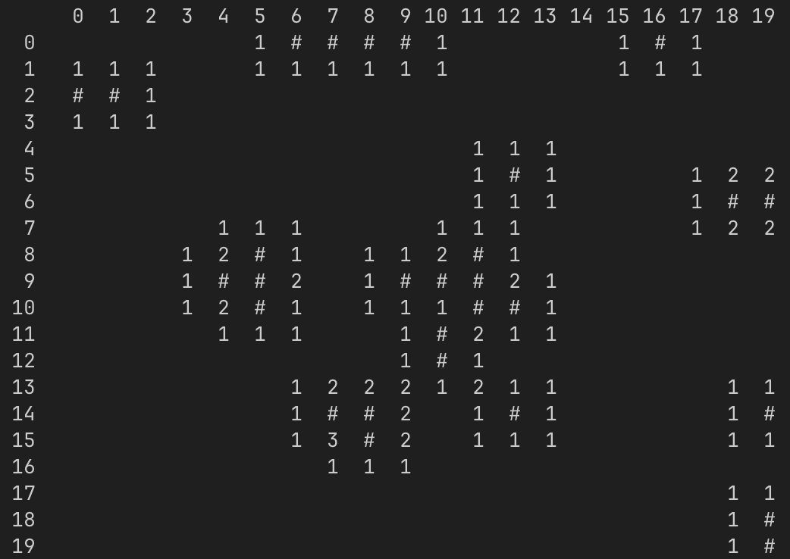

# Final Report

The project is a multi-client Minesweeper suite, centered on a Go API with shared Postgres state plus a Rust CLI (and room for a PHP web UI later) to prove one logic layer can power multiple frontends. The Go service (api/) builds boards, shuffles bombs, flood-fills reveals, tracks wins/losses and moves, exposes user creation/login plus game/new move/unfinished-game endpoints, and persists everything through db helpers. The Rust CLI wraps those endpoints with basic-auth login/creation, new game and resume flows, board rendering, and win/loss handling so players can play from the terminal.

## Diagrams

## What did you learn in this project?

This project was really helpful for my own learning. First and foremost it taught me two very popular and useful languages, Go and Rust, which will help me in my career to have well-rounded skills. I also learned how to configure and use a Docker container in order to easily run my development database. For testing, I became familiar with an open source tool called Bruno that I used to make requests to my api before the cli was finished.

## Does your project integrate with AI in any interesting way? If yes, please describe.

The project does not currently integrate with AI. A very interesting addition would be to have a "Hint" button if a player were to get stuck, which would have an AI agent analyze the board, and point to a suggested square for the player to click.

## How did you use AI to assist in building your project? Please, describe.

AI was very helpful because I was inexperienced in the two languages I used. When I ran into issues, I was able to ask it for help and receive personalized tutorials on how to fix the issue, and learn more about the language or syntax. I avoided "vibe coding" so that I could really get experience with the languages themselves rather than just have the AI do everything for me.

## Discuss why this project is interesting to you!

This project is interesting to me because I think that minesweeper is a really cool game, and being able to program the logic myself was a fun challenge. It has also always interested me to make my own CLI, in order to better understand what is happening when I work in the terminal.

## Key learnings from the project

1. How to program in Go
1. How to program in Rust
1. How to develop and test an API
1. How a CLI works under the hood

## Explanation if applicable of failover strategy, scaling characteristics, performance characteristics, authentication, concurrency, etc.

This project is fairly scalable due to the API being stateless. This means it can very easily be scaled horizontally and distributed over different regions to minimize load on any one system. The database must either be vertically scaled or divided by region (which is possible because any one user only accesses their own data).
